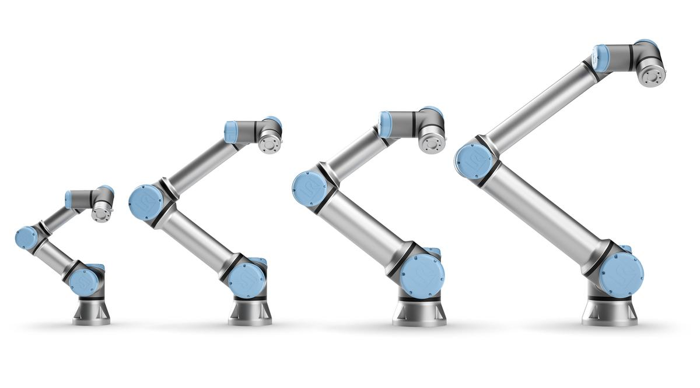

[](https://github.com/UniversalRobots/Universal_Robots_ROS_Driver/actions)

# Universal_Robots_ROS_Driver
Universal Robots have become a dominant supplier of lightweight, robotic manipulators for industry, as well as for scientific research and education. The Robot Operating System (ROS) has developed from a community-centered movement to a mature framework and quasi standard, providing a rich set of powerful tools for robot engineers and researchers, working in many different domains.

<center></center>

With the release of UR’s new e-Series, the demand for a ROS driver that supports the new manipulators and the newest ROS releases and paradigms like ROS-control has increased further. The goal of this driver is to provide a stable and sustainable interface between UR robots and ROS that strongly benefit all parties.

It is the core value of Universal Robots, to empower people to achieve any goal within automation. The success criteria of this driver release is to follow this vision, by providing the ROS community with an easy to use, stable and powerful driver, that empowers the community to reach their goals in research and automation without struggling with unimportant technical challenges, instability or lacking features.

## Acknowledgment
This driver is forked from the [ur_modern_driver](https://github.com/ros-industrial/ur_modern_driver).

Developed in collaboration between:

[](https://www.universal-robots.com/) &nbsp; and &nbsp;
[](https://www.fzi.de).

<!-- 
    ROSIN acknowledgement from the ROSIN press kit
    @ https://github.com/rosin-project/press_kit
-->

<a href="http://rosin-project.eu">
  
</a>

Supported by ROSIN - ROS-Industrial Quality-Assured Robot Software Components.  
More information: <a href="http://rosin-project.eu">rosin-project.eu</a>

  

This project has received funding from the European Union’s Horizon 2020  
research and innovation programme under grant agreement no. 732287. 


## How to report an issue
Before creating an issue, please have a look at the [Troubleshooting section](#Troubleshooting) of this document.

To create an issue on the [Issue Board](https://github.com/UniversalRobots/Universal_Robots_ROS_Driver/issues/new) please use the default template.

## How to get help
If you need help using this driver, please see the ROS-category in the [UR+ Developer Forum](https://forum.universal-robots.com/c/ros). 

## Features
 * Works for all **CB3 (with software version >= 3.12.0) and e-Series (software >= 5.5.1)** robots and uses the RTDE interface for communication, whenever possible.
 * **Factory calibration** of the robot inside ROS to reach Cartesian
   targets precisely.
 * **Realtime-enabled** communication structure to robustly cope with the 2ms cycle time of the
   e-Series. To use this, compile and run it on a kernel with the `PREEMPT_RT` patch enabled. (See
   the [Real-time setup guide](ur_robot_driver/doc/real_time.md) on how to achieve this)
 * Transparent **integration of the teach-pendant**. Using the URCaps system, a program is running
   on the robot that handles control commands sent from ROS side. With this, the robot can be
   **paused**, **stopped** and **resumed** without restarting the ROS driver.
   This will in the future also enable the usage of ROS-components as part of a more complex UR-program
   on the teach pendant. ROS-control of the robot can be quit using a service call to continue
   program execution on the TP.
 * Use the robot's **speed-scaling**. When speed scaling is active due to safety constraints or the
   speed slider is used, this gets correctly handled on the ROS side, as well slowing down
   trajectory execution accordingly.<br/>
   **Note**: Other ros-controllers based on a position interface
   can be used with this driver, but may behave wrong if the speed slider isn't set to 100% or if
   speed scaling slows down the robot. Also, the pausing function can only be used if the default
   scaled trajectory controller is used.
 * **ROS-Service-based replacement of most every-day TP-interactions** offer using UR robots without
   interacting with the teach pendant at all, if desired. The robot can be started, stopped and even
   recovery from safety events can be done using ROS service- and action calls. See the driver's
   [dashboard services](ur_robot_driver/doc/ROS_INTERFACE.md#ur_robot_driver_node) and the
   [robot_state_helper node](ur_robot_driver/doc/ROS_INTERFACE.md#robot_state_helper) for details.
 * Use **on-the-robot interpolation** for both Cartesian and
   joint-based trajectories. This is extremely helpful if your application can
   not meet the real-time requirements of the driver. Special types of
   [passthrough
   controllers](https://github.com/fzi-forschungszentrum-informatik/cartesian_ros_control/tree/beta-testing/pass_through_controllers)
   forward the trajectories directly to the robot, which then takes
   care of interpolation between the waypoints to achieve best performance.

Please see the external [feature list](ur_robot_driver/doc/features.md) for a listing of all features supported by this driver.

## Contents
This repository contains the new **ur_robot_driver** and a couple of helper packages, such as:

  * **ur_calibration**: Package around extracting and converting a robot's factory calibration
    information to make it usable by the robot_description.
  * **ur_robot_driver**: The actual driver package.

## Requirements
This driver requires a system setup with ROS. It is recommended to use **Ubuntu 18.04 with ROS
melodic**, however using Ubuntu 20.04 with ROS noetic should also work.

To make sure that robot control isn't affected by system latencies, it is highly recommended to use
a real-time kernel with the system. See the [real-time setup guide](ur_robot_driver/doc/real_time.md)
on information how to set this up.

## Preliminary UR16e support
This driver supports all UR variants including the UR16e. However, upstream support for the UR16e is
not finished, yet. When using the UR16e there is currently no support for gazebo or MoveIt!.

See [#97](https://github.com/UniversalRobots/Universal_Robots_ROS_Driver/pull/97) for details on
using the latest upstream develop branch of
[ros_industrial/universal_robot](https://github.com/ros-industrial/universal_robot) which includes
gazebo support for the ur16e, but no working MoveIt! support at the time of writing.

## Building

**Note:** The driver consists of a [C++
library](https://github.com/UniversalRobots/Universal_Robots_Client_Library) that abstracts the
robot's interfaces and a ROS driver on top of that. As the library can be built without ROS support,
it is not a catkin package and therefore requires a different treatment when being built inside the
workspace. See The alternative build method below if you'd like to build the library from source.

If you don't want to build the library from source, it is available as a binary package through the
ROS distribution of ROS melodic and noetic. It will be installed automatically if you
follow the steps below. If you'd like to also build the library from source, please follow the steps
explained in the [next section](#alternative-all-source-build).

```bash
# source global ros
$ source /opt/ros/<your_ros_version>/setup.bash

# create a catkin workspace
$ mkdir -p catkin_ws/src && cd catkin_ws

# clone the driver
$ git clone https://github.com/UniversalRobots/Universal_Robots_ROS_Driver.git src/Universal_Robots_ROS_Driver

# clone the description. Currently, it is necessary to use the melodic-devel branch.
$ git clone -b melodic-devel https://github.com/ros-industrial/universal_robot.git src/universal_robot

# install dependencies
$ sudo apt update -qq
$ rosdep update
$ rosdep install --from-paths src --ignore-src -y

# build the workspace
$ catkin_make

# activate the workspace (ie: source it)
$ source devel/setup.bash
```

### Alternative: All-source build
If you would like to also build the library from source, clone the library into your workspace, as
well and build it using either `catkin_make_isolated` or [`catkin
build`](https://catkin-tools.readthedocs.io/en/latest/verbs/catkin_build.html).

```bash
$ source /opt/ros/<your_ros_version>/setup.bash
$ mkdir -p catkin_ws/src && cd catkin_ws
$ git clone -b boost https://github.com/UniversalRobots/Universal_Robots_Client_Library.git src/Universal_Robots_Client_Library
$ git clone https://github.com/UniversalRobots/Universal_Robots_ROS_Driver.git src/Universal_Robots_ROS_Driver
$ git clone -b melodic-devel https://github.com/ros-industrial/universal_robot.git src/universal_robot
$ sudo apt update -qq
$ rosdep update
$ rosdep install --from-paths src --ignore-src -y
$ catkin_make_isolated
$ source devel_isolated/setup.bash
```

## Setting up a UR robot for ur_robot_driver
### Prepare the robot
For using the *ur_robot_driver* with a real robot you need to install the
**externalcontrol-x.x.x.urcap** which can be found [here](https://github.com/UniversalRobots/Universal_Robots_ExternalControl_URCap/releases).

For installing the necessary URCap and creating a program, please see the individual tutorials on
how to [setup a CB3 robot](ur_robot_driver/doc/install_urcap_cb3.md) or how to [setup an e-Series
robot](ur_robot_driver/doc/install_urcap_e_series.md).

To setup the tool communication on an e-Series robot, please consider the [tool communication setup
guide](ur_robot_driver/doc/setup_tool_communication.md).

### Prepare the ROS PC
For using the driver make sure it is installed (either by the debian package or built from source
inside a catkin workspace).

#### Extract calibration information
Each UR robot is calibrated inside the factory giving exact forward and inverse kinematics. To also
make use of this in ROS, you first have to extract the calibration information from the robot.

Though this step is not necessary to control the robot using this driver, it is highly recommended
to do so, as otherwise endeffector positions might be off in the magnitude of centimeters.


For this, there exists a helper script:

    $ roslaunch ur_calibration calibration_correction.launch \
      robot_ip:=<robot_ip> target_filename:="${HOME}/my_robot_calibration.yaml"

For the parameter `robot_ip` insert the IP address on which the ROS pc can reach the robot. As
`target_filename` provide an absolute path where the result will be saved to.

We recommend keeping calibrations for all robots in your organization in a common package. See the
[package's documentation](ur_calibration/README.md) for details.

#### Quick start
Once the driver is built and the **externalcontrol** URCap is installed on the
robot, you are good to go ahead starting the driver. (**Note**: We do
recommend, though, to [extract your robot's
calibration](#extract-calibration-information) first.)

To actually start the robot driver use one of the existing launch files

    $ roslaunch ur_robot_driver <robot_type>_bringup.launch robot_ip:=192.168.56.101

where **<robot_type>** is one of *ur3, ur5, ur10, ur3e, ur5e, ur10e, ur16e*. Note that in this example we
load the calibration parameters for the robot "ur10_example".

If you calibrated your robot before, pass that calibration to the launch file:

    $ roslaunch ur_robot_driver <robot_type>_bringup.launch robot_ip:=192.168.56.101 \
      kinematics_config:=$(rospack find ur_calibration)/etc/ur10_example_calibration.yaml

If the parameters in that file don't match the ones reported from the robot, the driver will output
an error during startup, but will remain usable.

For more information on the launch file's parameters see its own documentation.

Once the robot driver is started, load the [previously generated program](#prepare-the-robot) on the
robot panel that will start the *External Control* program node and execute it. From that moment on
the robot is fully functional. You can make use of the *Pause* function or even *Stop* (:stop_button:) the
program.  Simply press the *Play* button (:arrow_forward:) again and the ROS driver will reconnect.

Inside the ROS terminal running the driver you should see the output `Robot ready to receive control commands.`


To control the robot using ROS, use the action server on

```bash
/scaled_pos_joint_traj_controller/follow_joint_trajectory
```

Use this with any client interface such as [MoveIt!](https://moveit.ros.org/) or simply the
`rqt_joint_trajectory_controller` gui:

```
rosrun rqt_joint_trajectory_controller rqt_joint_trajectory_controller
```

You may need to install rqt_joint_trajectory_controller by running: 
```
sudo apt install ros-<ROS-DISTRO>-rqt-joint-trajectory-controller
```
where ROS-DISTRO will be replaced with your version of ROS.

For a more elaborate tutorial on how to get started, please see the
[usage example](ur_robot_driver/doc/usage_example.md).

### Replacing the robot description

In a real-world scenario you will want to replace the robot description with a description
containing the whole scene where the robot is acting in. For this, all the bringup launchfiles offer
the argument `robot_description_file` that should point to a launchfile loading the robot
description.

While the `load_urXXX.launch` files from the [ur_description](http://wiki.ros.org/ur_description)
package contain a lot of arguments to change the robot model, this driver only forwards the
`kinematics_config` parameter file. For further adaption please create your own `load_urXXX.launch`
file that fits your application and pass this to the `urXXX_bringup.launch` files from this package.

If you prefer decoupling loading the robot description and starting the driver, you can start the
`ur_control.launch` launchfile directly after the `robot_description` has been uploaded to the
parameter server.

## Troubleshooting

This section will cover some previously raised issues.

### I started everything, but I cannot control the robot.
The `External Control` program node from the URCap is not running on the robot. Make sure to create
a program containing this node on the robot and start it. Inside the ROS terminal you should see
the output `Robot ready to receive control commands.`

**Note:** When interacting with the teach pendant, or sending other primary programs to the robot, the
program will be stopped. On the ROS terminal you will see an output `Connection to robot dropped,
waiting for new connection`. In those cases, restart program execution (e.g. by pressing the play
button on the TP, or calling `rosservice call /ur_hardware_interface/dashboard/play` as explained [here](https://github.com/UniversalRobots/Universal_Robots_ROS_Driver/issues/33) and [here](ur_robot_driver/doc/ROS_INTERFACE.md#ur_robot_driver_node)).

In general, make sure you've completed the following tasks:

1. Install and setup the `External Control` URCap as explained
   [above](#setting-up-a-ur-robot-for-ur_robot_driver) (also setup the IP address **of the ROS
   pc** inside the URCap's installation.)
2. Start the driver handing the IP **of the robot** as explained in the
   [quickstart](#quick-start)
3. Load and start the previously generated program on the TP.

### When starting the program on the TP, I get an error "The connection to the remote PC could not be established"
Make sure, the IP address setup is correct, as described in the setup guides ([CB3 robots](ur_robot_driver/doc/install_urcap_cb3.md),
[e-Series robots](ur_robot_driver/doc/install_urcap_e_series.md))

**Note:** This error can also show up, when the ROS driver is not running.

### When starting the program on the TP, I get a `C207A0` error.
**Note:** With the current driver version this issue can only happen when the fieldbus is enabled
*after* the ROS driver has been started. Otherwise you will run into [#204](../../issues/204) when starting the driver
with an enabled EtherNet/IP fieldbus.

Most probably, the EtherNet/IP fieldbus is enabled in the robot's installation. If your setup includes an
Ethernet/IP fieldbus (note: EtherNet/IP != ethernet), make sure that it is
connected properly. In the Ethernet/IP fieldbus Installation screen
(e-series: *Installation > Fieldbus > EtherNet/IP*, CB3: *Installation > EtherNet/IP*) you can select the action that is being
executed upon a loss of EtherNet/IP Scanner connection. If you select "None",
save installation and program, then no exception is raised when no connection
to the fieldbus scanner can be established (note: This is only to get the
`External Control` running. You probably want to make sure that a connection to
the fieldbus scanner can indeed be made). If you don't use EtherNet/IP
fieldbusses at all, you can disable it in the same installation screen. 

### When starting the driver, it crashes with `Variable 'speed_slider_mask' is currently controlled by another RTDE client`
Probably, you are running into [#204](../../issues/204). Currently, this driver cannot be used together with an enabled
EtherNet/IP fieldbus. Disable EtherNet/IP to workaround this error. [#204](../../issues/204) contains a guide how to do
this.


### I cannot get a realtime kernel running together with an NVIDIA graphics card
This is a known issue and unfortunately we don't have a solution for this. The Nvidia kernel module
seems to not compile with every kernel. We recommend to use a multi-machine ROS setup in this
situation where a realtime-system is running the robot driver and a separate machine is performing
the computations requiring the graphics card.

### Why can't the driver use the extracted calibration info on startup?
This is mainly because parameters are loaded onto the parameter server before any nodes are started.

The `robot_description` concept inside ROS is not designed to be changed while a system is running.
Consumers of the urdf/`robot_description` (in terms of other ROS nodes) will not update the model
they have been loading initially. While technically the `robot_description` parameter could be altered during runtime
and any node that is started *afterwards* would see the updated model, this would lead to an inconsistent
application state (as some nodes will use the old model, while others use the updated one). In other words: It's not the driver that needs/benefits from this calibrated urdf, it's the rest of the ROS application and that will only see it *if* the calibrated version is present on the parameter server *before* nodes are started.

Additionally: If the calibration stored on the ROS side doesn't match the one of the robot controller, there's a good chance there is a reason for this and it
would be better to make updating it a conscious decision by a human (as the driver would not know *when* updating the model would be convenient or safe). Having to run the calibration
extraction/transformation as a separate step makes this possible and doesn't hide this step from the
end user.

### Can this driver be used inside a combined hardware interface?
Yes, this is possible. However, if used inside a [combined HW
interface](http://wiki.ros.org/combined_robot_hw) we recommend to enable [non-blocking read
functinality](https://github.com/UniversalRobots/Universal_Robots_ROS_Driver/blob/master/ur_robot_driver/doc/ROS_INTERFACE.md#non_blocking_read-default-false).

### I sent raw script code to the robot but it is not executed
On the e-Series the robot has to be in [remote control
mode](ur-robot-driver/README.md#remote-control-mode) to accept script code from an external source.
This has to be switched from the Teach-Pendant.

### Using the dashboard doesn't work
On the e-Series the robot has to be in [remote control
mode](ur-robot-driver/README.md#remote-control-mode) to accept certain calls on the dashboard server.
See [Available dashboard
commands](https://www.universal-robots.com/articles/ur-articles/dashboard-server-cb-series-port-29999/)
for details.

### Passthrough controllers: The robot does not fully reach trajectory points even though I have specified the path tolerance to be 0
If you are using a control modes that forwards trajectories to the robot, currently the path tolerance is ignored. The corresponding interface on the robot and client-library level exists in the form of a "blend radius", but is not utilized by this ROS driver. For more information see this [issue](https://github.com/UniversalRobots/Universal_Robots_ROS_Driver/issues/352).

### Can I use the Cartesian controllers together with MoveIt!?
Not directly, no. MoveIt! plans a Cartesian path and then creates a joint trajectory out of that for
execution, as the common interface to robot drivers in ROS is the
[FollowJointTrajectory](http://docs.ros.org/en/noetic/api/control_msgs/html/action/FollowJointTrajectory.html)
action.

For supporting Cartesian controllers inside MoveIt! changes would have to be made to MoveIt! itself.
