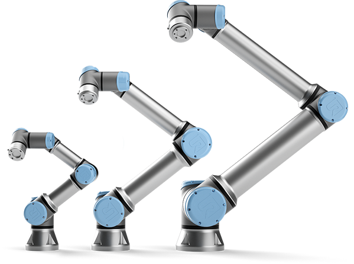
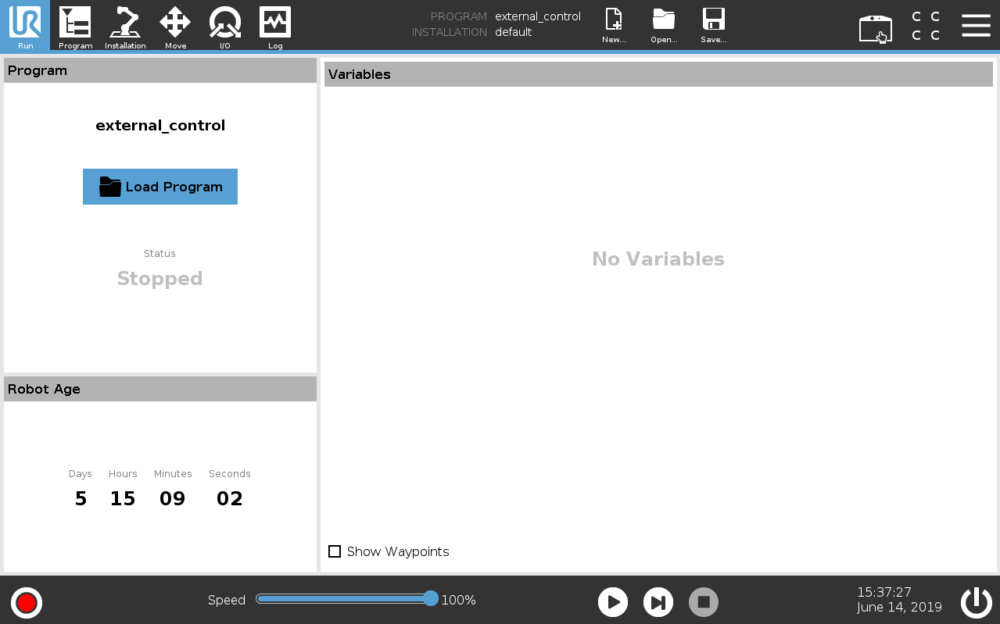
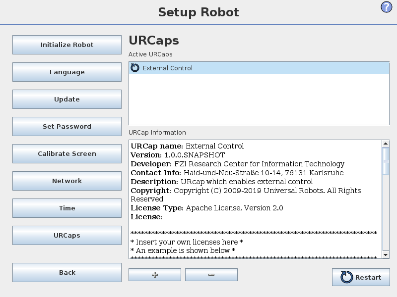
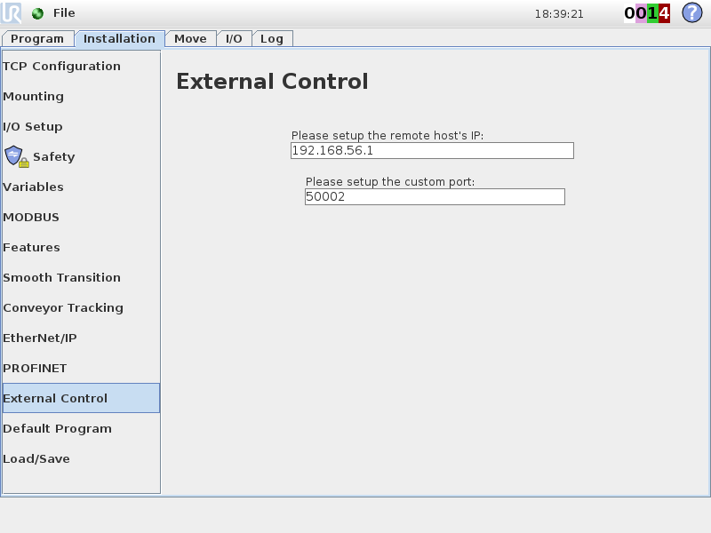
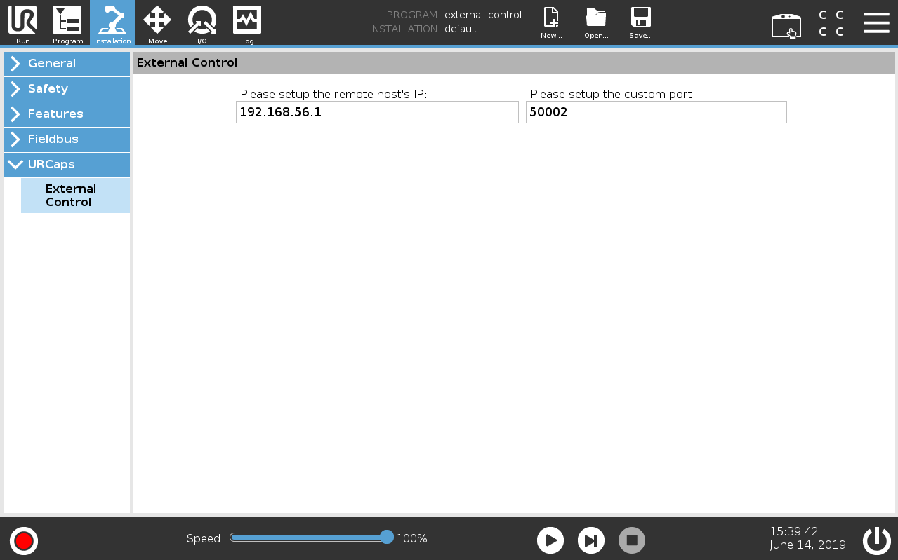
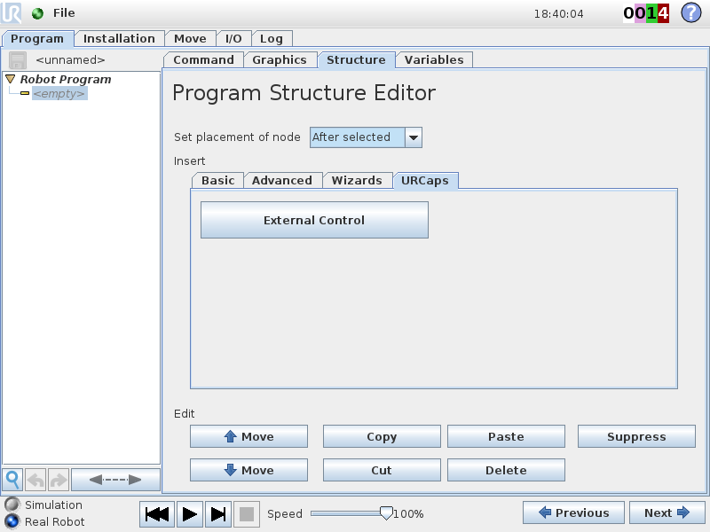
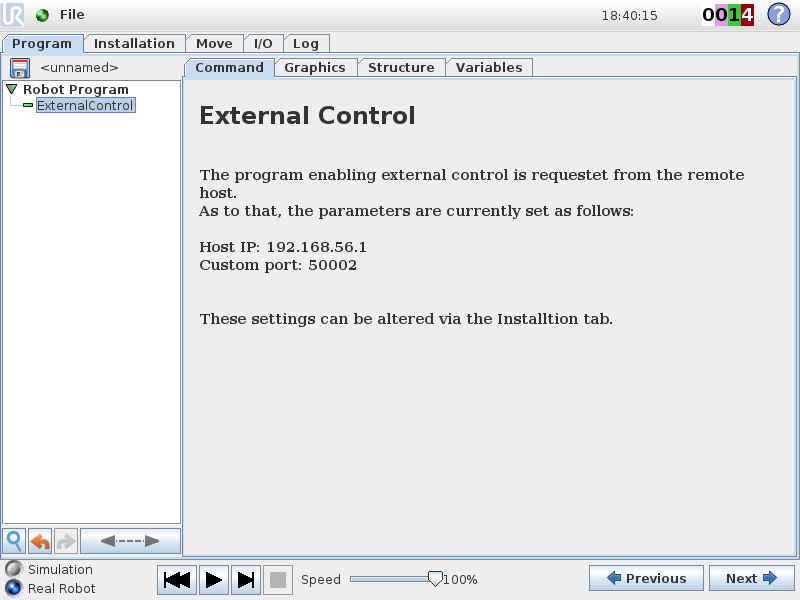
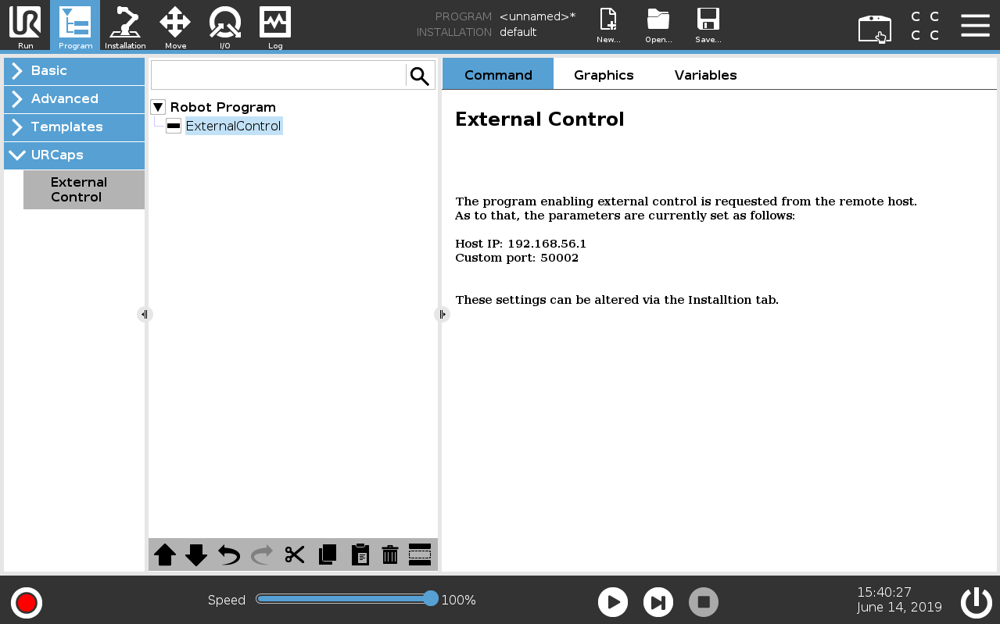

# Universal_Robots_ROS_Driver
Universal Robots have become a dominant supplier lightweight, robotic manipulators for industry, as well as for scientific research and education. The Robot Operating System (ROS) has developed from a community-centered movement to a mature framework and quasi standard, providing a rich set of powerful tools for robot engineers and researchers, working in many different domains.

<center></center>

With the release of UR’s new e-Series, the demand for a ROS driver that supports the new manipulators and the newest ROS releases and paradigms like ROS-control have increased further increase. The goal of this driver is to provide a stable and sustainable interface between UR robots and ROS that strongly benefit all parties.

It is the core value of Universal Robots, to empower people to achieve any goal within automation. The success criteria of this driver release is to follow this vision, by providing the ROS community with an easy to use, stable and powerful driver, that empowers the community to reach their goals in research and automation without struggling with unimportant technical challenges, instability or lacking features.

### Acknowledgement
This driver is forked from the [ur_modern_driver](https://github.com/ros-industrial/ur_modern_driver).

## How to report a Issue
Create an issue on the [Issue Board](https://gitlab.com/ur_ros_beta/universal_robots_ros_driver/issues) and use [Issue #1 as a template](https://gitlab.com/ur_ros_beta/universal_robots_ros_driver/issues/1).

## Features
 * Works for all **CB3 (with software version >= 3.7) and eSeries (software >= 5.1)** robots and uses the RTDE interface for communication, whenever possible.
 * **Factory calibration** of the robot inside ROS to reach Cartesian
   targets precisely.
 * **Realtime-enabled** communication structure to robustly cope with the 2ms cycle time of the eSeries. To use this, compile and run it on a kernel with the `PREEMPT_RT` patch enabled. (TODO: Write tutorial on how to compile a realtime kernel for Ubuntu)
 * Transparent **integration of the teach-pendant**. Using the URCaps system, a program is running
   on the robot that handles control commands sent from ROS side. With this, the robot can be
   **paused**, **stopped** and **resumed** without restarting the ROS driver.
   This will in the future also enable, the usage of ROS-components as a part of a more complex UR-program
   on the teach pendant. This is currently not yet supported, as we are still missing to exit
   control from ROS side. Expect this to come in future releases.
 * Use the robot's **speed-scaling**. When speed scaling is active due to safety constraints or the
   speed slider is used, this gets correctly handled on the ROS side, as well slowing down
   trajectory execution accordingly.<br/>
   **Note**: Other ros-controllers based on a position interface
   can be used with this driver, but may behave wrong if the speed slider isn't set to 100% or if
   speed scaling slows down the robot. Also, the pausing function can only be used, if the default
   scaled trajectory controller is used.

## Contents
This repository contains the new **ur_rtde_driver** and a couple of helper packages, such as:

  * **controller_stopper**: A small external tool that stops and restarts ros-controllers based on
    the robot's state. This can be helpful, when the robot is in a state, where it won't accept
    commands sent from ROS.
  * **ur_calibration**: Package around extracting and converting a robot's factory calibration
    information to make it usable by the robot_description.
  * **ur_controllers**: Controllers introduced with this driver, such as speed-scaling-aware
    controllers.
  * **ur_rtde_driver**: The actual driver package.

## Building

```bash
# source global ros
$ source /opt/ros/<your_ros_version>/setup.bash
# create a catkin workspace
$ mkdir -p catkin_ws/src && cd catkin_ws
$ catkin_make
$ cd src
# clone the driver
$ git clone <this_repository_url>
# clone fork of the description to use the calibration feature
$ git clone -b calibration_devel https://github.com/fmauch/universal_robot.git
# install dependencies
$ rosdep install --from-path . -y --ignore-src
# build the driver
$ cd ..
$ catkin_make
# source the workspace
$ source devel/setup.bash
```

## Setting up a UR robot for ur_rtde_driver
### Prepare the robot
For using the *ur_rtde_driver* with a real robot you need to install the
**externalcontrol-1.0.urcap** which can be found inside the **resources** folder of this driver.

**Note**: For installing this URCap a minimal PolyScope version of 3.7 or 5.1 (in case of eSeries) is
necessary.

To install it you first have to copy it to the robot's **programs** folder which can be done either
via scp or using a USB stick. The installation process is similar for CB3 and eSeries robots and
will be shown side-to-side in this guide.

<tr>
<td>  </td>
<td>  </td>
</tr>

On the welcome screen select *Setup Robot* and then *URCaps* to enter the URCaps installation screen
(For eSeries click on the hamburger menu in the top-right corner to get to the setup menu). There,
click the little plus sign at the bottom to open the file selector. There you should see all urcap
files stored inside the robot's programs folder or a plugged USB drive.  Select and open the
**externalcontrol-1.0.urcap** file and click *open*. Your URCaps view should now show the
**External Control** in the list of active URCaps and a notification to restart the robot. Do that
now.

<tr>
<td>  </td>
<td>  </td>
</tr>

After the reboot you should find the **External Control** URCaps inside the *Installation* section.
For this select *Program Robot* on the welcome screen, select the *Installation* tab and select
**External control** from the list.

<tr>
<td>  </td>
<td>  </td>
</tr>

Here you'll have to setup the IP address of the external PC which will be running the ROS driver.
Note that the robot and the external PC have to be in the same network, ideally in a direct
connection with each other to minimize network disturbances. The custom port should be left
untouched for now.

To use the new URCaps, create a new program and insert the **External Control** program node into
the program tree:

<tr>
<td>  </td>
<td>  </td>
</tr>

If you click on the *command* tab again, you'll see the settings entered inside the *Installation*.
Check that they are correct, then save the program.

<tr>
<td>  </td>
<td>  </td>
</tr>

### Prepare the ROS PC
For using the driver make sure it is installed (either by the debian package or built from source
inside a catkin workspace).

#### Extract calibration information
Each UR robot is calibrated inside the factory giving exact forward and inverse kinematics. To also
make use of this in ROS, you first have to extract the calibration information from the robot.

Though this step is not necessary, to control the robot using this driver, it is highly recommended
to do so, as endeffector positions might be off in the magnitude of centimeters.

For this, there exists a helper script:

    $ roslaunch ur_calibration calibration_correction.launch \
    robot_ip:=192.168.56.101 \
    robot_name:=ur10_example \
    output_package_name:=ur_calibration \
    subfolder_name:=etc

As soon as you see the output
    
    [ INFO] [1560953586.352160902]: Calibration correction done

you can exit the roslaunch by bressing `CTRL+C`.

For the parameter **robot_ip** insert the ip on which the ROS pc can reach the robot. The
**robot_name** is an arbitrary name you can give to the robot. It is recommended, to choose a unique
name that can be easily matched to the physical robot.

The script will then extract the calibration information from the robot and convert it to a yaml
syntax that can be used by the robot_description.

The resulting yaml file is stored in the package specified in the **output_package_name** parameter
inside the folder **subfolder_name** with the name **robot_name***_calibration.yaml*. The parameter
**subfolder_name** is optional and defaults to *etc* if not given.

In the example above, we use the **ur_calibration** package from this repository. This won't work,
if you use a binary installation of this driver. In that case please create an own ROS package as
described below.

**Note:** You'll have to provide the name of an existing package. It is recommended to have a
package storing all calibrations of all UR robots inside your organization. This way, the extraction
as described in this package has only to be performed once and the calibration can be reused by
other users.
To create a new package, go to your catkin_workspace's src folder and call

    catkin_create_pkg my_calibrations

It is recommended to adapt the new package's *package.xml* with a meaningful description.

#### Start the robot driver
To actually start the robot driver use one of the existing launchfiles

    $ roslaunch ur_rtde_driver <robot_type>_bringup.launch robot_ip:=192.168.56.101 \
    kinematics_config:=$(rospack find ur_calibration)/etc/ur10_example_calibration.yaml

where **<robot_type>** is one of *ur3, ur5, ur10, ur3e, ur5e, ur10e*. Note that in this example we
load the calibration parameters for the robot "ur10_example". If the parameters in that file don't
match the ones reported from the robot, the driver will output an error during startup.

For more information on the launchfile's parameters see its own documentation.

Once the robot driver is started, load the previously generated program on the robot panel and
execute it. From that moment on the robot is fully functional. You can make use of the pause
function or even stop the program. Simply press the play button again and the ROS driver will
reconnect.

#### Use the action server
After starting up the robot as described in the last section a scaled position based trajectory
controller is started. It's action-server is located at

```bash
/scaled_pos_traj_controller/follow_joint_trajectory
```

Use this with any client interface such as MoveIt! or simply the joint_trajectory_controller rqt
gui:

```
rosrun rqt_joint_trajectory_controller rqt_joint_trajectory_controller
```
