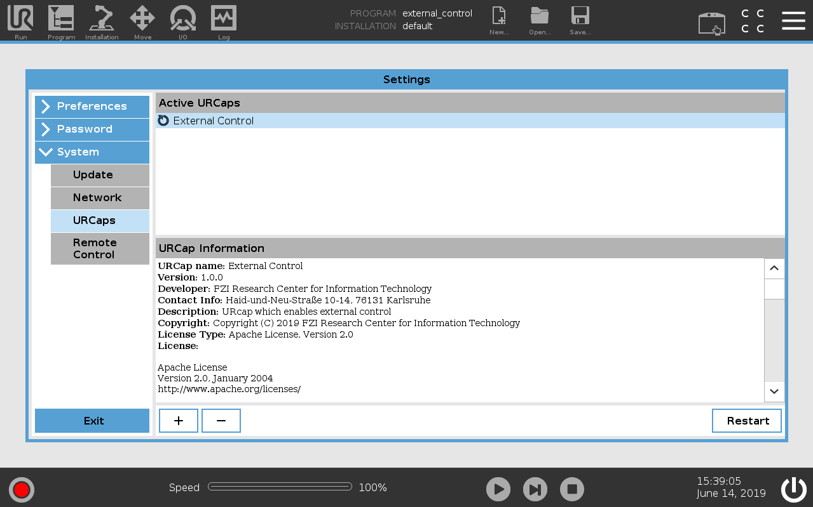
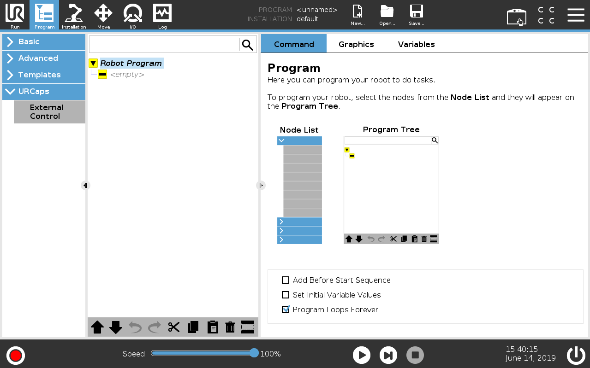
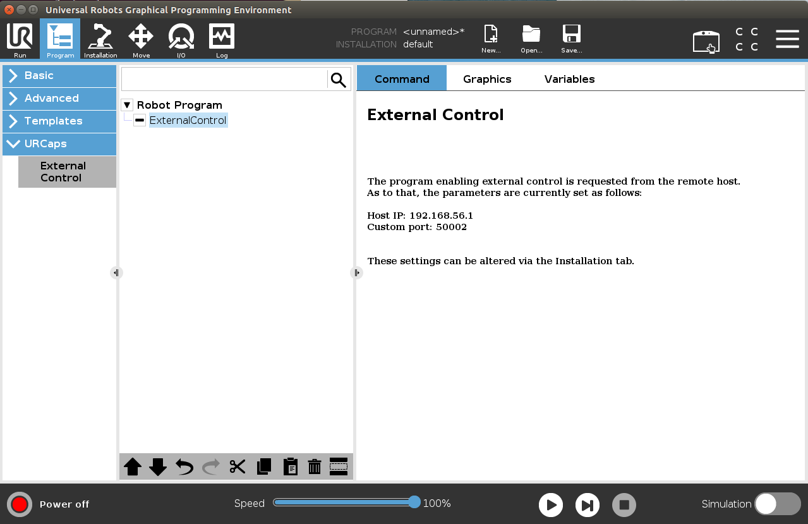

# Installing a URCap on a e-Series robot

For using the *ur_robot_driver* with a real robot you need to install the
**externalcontrol-1.0.2.urcap** which can be found inside the **resources** folder of this driver.

**Note**: For installing this URCap a minimal PolyScope version of 5.1 is necessary.

To install it you first have to copy it to the robot's **programs** folder which can be done either
via scp or using a USB stick.

On the welcome screen click on the hamburger menu in the top-right corner and select *Settings* to enter the robot's setup.  There select *System* and then *URCaps* to enter the URCaps installation screen.

 

There, click the little plus sign at the bottom to open the file selector. There you should see
all urcap files stored inside the robot's programs folder or a plugged USB drive.  Select and open
the **externalcontrol-1.0.2.urcap** file and click *open*. Your URCaps view should now show the
**External Control** in the list of active URCaps and a notification to restart the robot. Do that
now.

 

After the reboot you should find the **External Control** URCaps inside the *Installation* section.
For this select *Program Robot* on the welcome screen, select the *Installation* tab and select
**External Control** from the list.

 

Here you'll have to setup the IP address of the external PC which will be running the ROS driver.
Note that the robot and the external PC have to be in the same network, ideally in a direct
connection with each other to minimize network disturbances. The custom port should be left
untouched for now.

 

To use the new URCaps, create a new program and insert the **External Control** program node into
the program tree

 

If you click on the *command* tab again, you'll see the settings entered inside the *Installation*.
Check that they are correct, then save the program. Your robot is now ready to be used together with
this driver.
