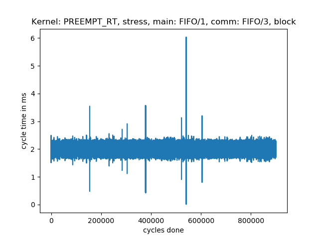
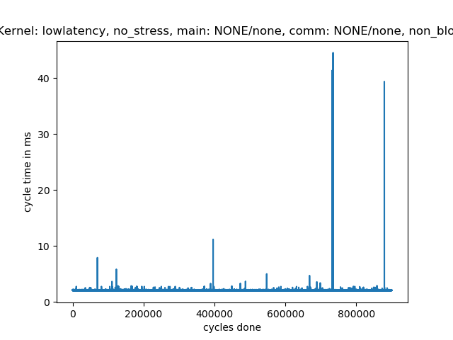
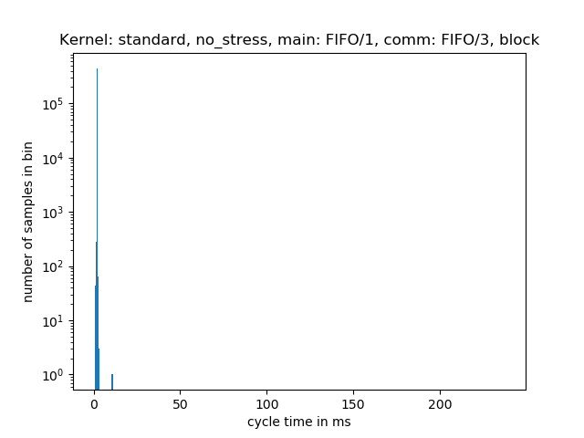

# How does the kernel and scheduling parameters affect the driver's performance?
## System description
In order to understand the different test scenarios it is important to understand the control flow
and dependencies inside the driver's communication. For this see the following drawing:

Let's first have a look on the robot side. In the main thread we have the RTDE sender that sends
real-time data from the robot in each cycle. Additionally, the ReverseInterface socket reads
commands sent from an external source in each cycle. There it has a timeout of 2 milliseconds. If
no data can be read, a `keepalive` counter is decreased by `1`. If the `keepalive` counter gets
`0`, the connection is considered broken and the program stops all communication, stops the robot
and shuts down (leaves the program node). By default the `keepalive_counter` is set to `1` in the
ROS driver, meaning communication (and therefore the program) stops if no data could be received for
the time since the last `read` call plus two milliseconds.

On ROS side we have a producer thread that reads data from RTDE (which is a blocking operation,
hence the separate thread). The main thread reads the data from the producer, generates control
commands by updating the controller and finally sends back data to the ReverseInterface socket.
Reading from the producer can be either done blocking (meaning to wait until there is new data
available) or non-blocking in which case the controller update is being calculated on old data.

From that structure we can see that it is mandatory to send motion commands to the robot in a very
reliable and consistent frequency. The upper bound between two consecutive send operations would be
the cycle time plus the 2 ms timeout. In case of an e-Series robot that would boil down to 4 ms
(That being an upper bound that would probably already cause problems).

The intention of the blocking read is to let the robot dictate the pace to make sure we always work
on recent data.

There are other threads involved in the driver and also in communication between the robot and the
driver, but they don't directly participate in the actual control structure, hence they are left out
here.

In order to get things running smoothly we recommend using a real-time kernel with FIFO scheduling
for the main thread and the producer thread.

## Test description
As a test system we used a shuttle PC with an Intel(R) Core(TM) i5-8500 CPU with 6 virtual cores. A
direct network connection between the shuttle and the UR controller box was used to keep
disturbances from network traffic to a minimum. We did not deactivate the CPU's frequency scaling,
as this is probably not done on a default setup, as well.

Each test was performed for 30 minutes, the period $t_n$ of each control cycle is recorded and saved,
resulting in $N=3600$ samples. From this the median $\tilde{t}$, mean $\bar{t}$, minimum and maximum
values are calculated, as well as a jitter and RMS error score.

The jitter is calculated as

$$j=\frac{\sum_{n=2}^N \left|t_n - t_{n-1}\right|}{N-1}$$

and the RMS score is calculated as

$$e_{rms}=\sqrt{\frac{1}{N} \sum_{n=1}^{N}\left(t_n - \bar{t} \right)^2}$$

There are a number of parameters we can change throughout the tests:

- stress / no stress on the system

  *On a stressed system chances are higher that the CPU will be busy doing other stuff and therefore
  delaying execution.*

- FIFO scheduling (with high priority) vs. standard scheduling

  *With FIFO scheduling threads with a high priority should be handled first if there are multiple
  threads with work to do. In the tests we used the highest priority possible.*

- CPU core affinity

  *With setting a CPU affinity to a specific core, a thread will not be moved between different CPU
  cores, which could introduce further delays.*

- Blocking vs. non-blocking read

  *As explained above, a blocking read might make the control thread wait longer than the actual
  cycle time.*

## Test results

For our tests we restrict the parameter space to look at ten different combinations for each
kernel:

1. no stress, FIFO scheduling, CPU core affinity (to cores 1 and 3), blocking read
1. no stress, FIFO scheduling, CPU core affinity (to cores 1 and 3), non-blocking read
1. no stress, standard scheduling, no CPU core affinity, blocking read
1. no stress, standard scheduling, no CPU core affinity, non-blocking read
1. stress, FIFO scheduling, no CPU core affinity, blocking read
1. stress, FIFO scheduling, no CPU core affinity, non-blocking read
1. stress, FIFO scheduling, CPU core affinity (to cores 1 and 3), blocking read
1. stress, FIFO scheduling, CPU core affinity (to cores 1 and 3), non-blocking read
1. stress, standard scheduling, no CPU core affinity, blocking read
1. stress, standard scheduling, no CPU core affinity, non-blocking read

Below table lists the resulting data for each configuration. At the end of the document there are
plots for each time configuration showing a more detailed picture.

<table style="text-align: center">
    <tr>
        <th>ID</th>
        <th>Stress</th>
        <th>Scheduling/core</th>
        <th>Blocking producer</th>
        <th>Kernel</th>
        <th>Cycle time [ms]</th>
        <th>Jitter</th>
        <th>$e_{rms}$</th>
    </tr>
    <tr>
        <th></th>
        <th></th>
        <th>main producer</th>
        <th>blocking</th>
        <th></th>
        <th>Median Min Max</th>
        <th></th>
        <th></th>
    </tr>

<tr>
        <td>1</td>
        <td>no_stress</td>
        <td>
          FIFO/1 
          FIFO/3
        </td>
        <td>block</td>
        <td>PREEMPT_RT</td>
        <td>2.0 1.19 2.78</td>
        <td>0.08</td>
        <td>0.06</td>
    </tr>
<tr>
        <td>2</td>
        <td>no_stress</td>
        <td>
          FIFO/1 
          FIFO/3
        </td>
        <td>non_block</td>
        <td>PREEMPT_RT</td>
        <td>2.02 2.0 2.45</td>
        <td>0.03</td>
        <td>0.02</td>
    </tr>
<tr>
        <td>3</td>
        <td>no_stress</td>
        <td>
          NONE/none 
          NONE/none
        </td>
        <td>block</td>
        <td>PREEMPT_RT</td>
        <td>2.0 0.01 13.87</td>
        <td>0.08</td>
        <td>0.06</td>
    </tr>
<tr>
        <td>4</td>
        <td>no_stress</td>
        <td>
          NONE/none 
          NONE/none
        </td>
        <td>non_block</td>
        <td>PREEMPT_RT</td>
        <td>2.06 2.0 16.36</td>
        <td>0.03</td>
        <td>0.08</td>
    </tr>
<tr>
        <td>5</td>
        <td>stress</td>
        <td>
          FIFO/1 
          FIFO/3
        </td>
        <td>block</td>
        <td>PREEMPT_RT</td>
        <td>2.0 0.01 6.04</td>
        <td>0.03</td>
        <td>0.03</td>
    </tr>
<tr>
        <td>6</td>
        <td>stress</td>
        <td>
          FIFO/1 
          FIFO/3
        </td>
        <td>non_block</td>
        <td>PREEMPT_RT</td>
        <td>2.0 2.0 2.35</td>
        <td>0.0</td>
        <td>0.0</td>
    </tr>
<tr>
        <td>7</td>
        <td>stress</td>
        <td>
          FIFO/none 
          FIFO/none
        </td>
        <td>block</td>
        <td>PREEMPT_RT</td>
        <td>2.0 0.38 3.63</td>
        <td>0.04</td>
        <td>0.04</td>
    </tr>
<tr>
        <td>8</td>
        <td>stress</td>
        <td>
          FIFO/none 
          FIFO/none
        </td>
        <td>non_block</td>
        <td>PREEMPT_RT</td>
        <td>2.0 2.0 2.36</td>
        <td>0.0</td>
        <td>0.0</td>
    </tr>
<tr>
        <td>9</td>
        <td>stress</td>
        <td>
          NONE/none 
          NONE/none
        </td>
        <td>block</td>
        <td>PREEMPT_RT</td>
        <td>2.0 0.0 14.07</td>
        <td>0.05</td>
        <td>0.09</td>
    </tr>
<tr>
        <td>10</td>
        <td>stress</td>
        <td>
          NONE/none 
          NONE/none
        </td>
        <td>non_block</td>
        <td>PREEMPT_RT</td>
        <td>2.06 2.0 4.29</td>
        <td>0.01</td>
        <td>0.02</td>
    </tr>
<tr>
        <td>11</td>
        <td>no_stress</td>
        <td>
          FIFO/1 
          FIFO/3
        </td>
        <td>block</td>
        <td>lowlatency</td>
        <td>2.0 0.01 3.21</td>
        <td>0.11</td>
        <td>0.07</td>
    </tr>
<tr>
        <td>12</td>
        <td>no_stress</td>
        <td>
          FIFO/1 
          FIFO/3
        </td>
        <td>non_block</td>
        <td>lowlatency</td>
        <td>2.02 2.0 2.27</td>
        <td>0.03</td>
        <td>0.03</td>
    </tr>
<tr>
        <td>13</td>
        <td>no_stress</td>
        <td>
          NONE/none 
          NONE/none
        </td>
        <td>block</td>
        <td>lowlatency</td>
        <td>2.0 0.01 46.23</td>
        <td>0.08</td>
        <td>0.16</td>
    </tr>
<tr>
        <td>14</td>
        <td>no_stress</td>
        <td>
          NONE/none 
          NONE/none
        </td>
        <td>non_block</td>
        <td>lowlatency</td>
        <td>2.08 2.0 44.54</td>
        <td>0.03</td>
        <td>0.08</td>
    </tr>
<tr>
        <td>15</td>
        <td>stress</td>
        <td>
          FIFO/1 
          FIFO/3
        </td>
        <td>block</td>
        <td>lowlatency</td>
        <td>2.0 0.01 11.01</td>
        <td>0.03</td>
        <td>0.03</td>
    </tr>
<tr>
        <td>16</td>
        <td>stress</td>
        <td>
          FIFO/1 
          FIFO/3
        </td>
        <td>non_block</td>
        <td>lowlatency</td>
        <td>2.0 2.0 2.28</td>
        <td>0.0</td>
        <td>0.0</td>
    </tr>
<tr>
        <td>17</td>
        <td>stress</td>
        <td>
          FIFO/none 
          FIFO/none
        </td>
        <td>block</td>
        <td>lowlatency</td>
        <td>2.0 1.62 2.4</td>
        <td>0.03</td>
        <td>0.02</td>
    </tr>
<tr>
        <td>18</td>
        <td>stress</td>
        <td>
          FIFO/none 
          FIFO/none
        </td>
        <td>non_block</td>
        <td>lowlatency</td>
        <td>2.0 2.0 2.29</td>
        <td>0.0</td>
        <td>0.0</td>
    </tr>
<tr>
        <td>19</td>
        <td>stress</td>
        <td>
          NONE/none 
          NONE/none
        </td>
        <td>block</td>
        <td>lowlatency</td>
        <td>2.0 0.0 7.51</td>
        <td>0.03</td>
        <td>0.04</td>
    </tr>
<tr>
        <td>20</td>
        <td>stress</td>
        <td>
          NONE/none 
          NONE/none
        </td>
        <td>non_block</td>
        <td>lowlatency</td>
        <td>2.05 2.0 10.44</td>
        <td>0.01</td>
        <td>0.03</td>
    </tr>
<tr>
        <td>21</td>
        <td>no_stress</td>
        <td>
          FIFO/1 
          FIFO/3
        </td>
        <td>block</td>
        <td>standard</td>
        <td>2.0 0.01 237.63</td>
        <td>0.11</td>
        <td>0.5</td>
    </tr>
<tr>
        <td>22</td>
        <td>no_stress</td>
        <td>
          FIFO/1 
          FIFO/3
        </td>
        <td>non_block</td>
        <td>standard</td>
        <td>2.03 2.0 237.18</td>
        <td>0.04</td>
        <td>0.43</td>
    </tr>
<tr>
        <td>23</td>
        <td>no_stress</td>
        <td>
          NONE/none 
          NONE/none
        </td>
        <td>block</td>
        <td>standard</td>
        <td>2.0 0.01 14.04</td>
        <td>0.08</td>
        <td>0.07</td>
    </tr>
<tr>
        <td>24</td>
        <td>no_stress</td>
        <td>
          NONE/none 
          NONE/none
        </td>
        <td>non_block</td>
        <td>standard</td>
        <td>2.09 2.01 11.71</td>
        <td>0.03</td>
        <td>0.03</td>
    </tr>
<tr>
        <td>25</td>
        <td>stress</td>
        <td>
          FIFO/1 
          FIFO/3
        </td>
        <td>block</td>
        <td>standard</td>
        <td>2.0 0.01 226.98</td>
        <td>0.03</td>
        <td>0.53</td>
    </tr>
<tr>
        <td>26</td>
        <td>stress</td>
        <td>
          FIFO/1 
          FIFO/3
        </td>
        <td>non_block</td>
        <td>standard</td>
        <td>2.0 2.0 224.22</td>
        <td>0.0</td>
        <td>0.23</td>
    </tr>
<tr>
        <td>27</td>
        <td>stress</td>
        <td>
          FIFO/none 
          FIFO/none
        </td>
        <td>block</td>
        <td>standard</td>
        <td>2.0 0.01 223.82</td>
        <td>0.03</td>
        <td>0.56</td>
    </tr>
<tr>
        <td>28</td>
        <td>stress</td>
        <td>
          FIFO/none 
          FIFO/none
        </td>
        <td>non_block</td>
        <td>standard</td>
        <td>2.0 2.0 225.51</td>
        <td>0.0</td>
        <td>0.33</td>
    </tr>
<tr>
        <td>29</td>
        <td>stress</td>
        <td>
          NONE/none 
          NONE/none
        </td>
        <td>block</td>
        <td>standard</td>
        <td>2.0 0.0 117.19</td>
        <td>0.05</td>
        <td>0.41</td>
    </tr>
<tr>
        <td>30</td>
        <td>stress</td>
        <td>
          NONE/none 
          NONE/none
        </td>
        <td>non_block</td>
        <td>standard</td>
        <td>2.05 2.0 40.06</td>
        <td>0.01</td>
        <td>0.16</td>
    </tr>

</table>

## Conclusion
The plot below shows scatter plots of all the different combinations grouped by the kernel used.

The main conclusions drawn from this are:

- Using a non-blocking read helps keeping cycle times closer to what they should be and has the
  greatest impact on the jitter. (All odd configurations use a blocking read, while all even numbers
  use a non-blocking read.)

- Using a standard kernel without further measures introduces a lot of cycles with a longer cycle
  time than the expected 2 ms. Using FIFO scheduling and CPU core affinity improves the situation
  significantly, but there is still too little reliability in short cycle times.

- Using a lowlatency kernel significantly reduces extremely long cycle times, a PREEMPT_RT reduces
  them even further. However, using a real-time kernel alone also does not bring the desired
  guaranteed cycle time of 2 ms.

- Using FIFO scheduling (at least combined with a high thread priority) has the biggest impact on
  keeping cycle times in the desired range on a stressed system. It seems to have a clear and strong
  impact on all evaluated kernels.

- At a first glance it seems odd that the non-stressed system on the lowlatency kernel shows higher
  cycle times than the stressed system with the same configuration. We think that this is due to the
  CPU frequency scaling being without any effect when the system is on full load already, anyway.

### Operation recommendations
In order to get the most stable experience we recommend using a PREEMPT_RT or at least lowlatency
kernel combined with FIFO scheduling enabled to run the driver on. Since the lowlatency kernel is directly available using the standard
Ubuntu repository, that's probably the easiest to setup.

In order to activate FIFO scheduling for the driver, the user running the driver must be given the
privileges to do so. For this, we recommend creating a separate usergroup and allow members of this
group to setup the scheduling parameters. See the [real-time setup guide](https://github.com/UniversalRobots/Universal_Robots_ROS_Driver/blob/master/ur_robot_driver/doc/real_time.md) for details on this.

## Individual Plots
This section shows all cycle times in a time series and the cycle time histogram.

  ### Configuration #1
  
  

  ### Configuration #2
  
  

  ### Configuration #3
  
  

  ### Configuration #4
  
  

  ### Configuration #5
  
  

  ### Configuration #6
  
  

  ### Configuration #7
  
  

  ### Configuration #8
  
  

  ### Configuration #9
  
  

  ### Configuration #10
  
  

  ### Configuration #11
  
  

  ### Configuration #12
  
  

  ### Configuration #13
  
  

  ### Configuration #14
  
  

  ### Configuration #15
  
  

  ### Configuration #16
  
  

  ### Configuration #17
  
  

  ### Configuration #18
  
  

  ### Configuration #19
  
  

  ### Configuration #20
  
  

  ### Configuration #21
  
  

  ### Configuration #22
  
  

  ### Configuration #23
  
  

  ### Configuration #24
  
  

  ### Configuration #25
  
  

  ### Configuration #26
  
  

  ### Configuration #27
  
  

  ### Configuration #28
  
  

  ### Configuration #29
  
  

  ### Configuration #30
  
  
