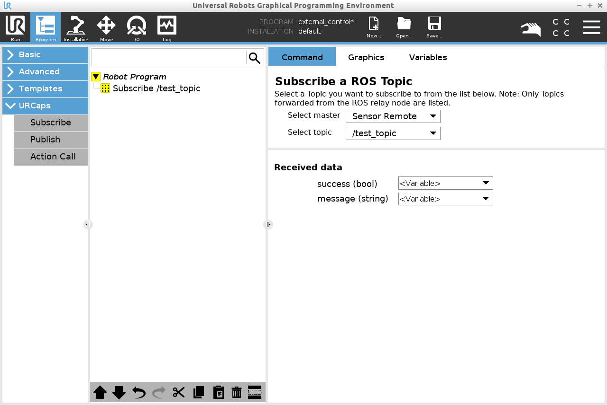
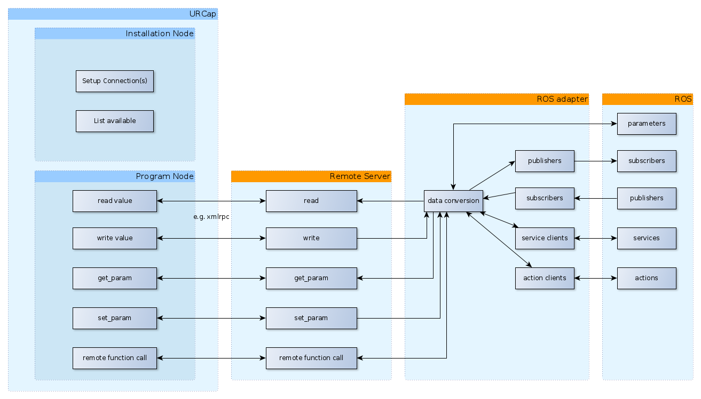
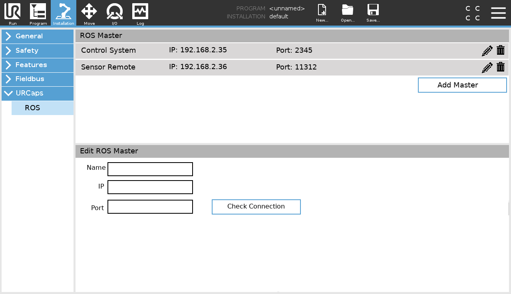

# URCap-ROS interface

This document describes the design of the "ROS as a service" part of our current FTP (Milestone 4).

The basic idea is to keep the teach pendant program the main execution point while still leveraging advanced functionality through ROS.

## Available components
To leverage ROS inside a robot program, the following components will be made available by this extension.

### ROS-Topic subscriber

Backend (ROS side) creates subscriber if program node in program

 - ProgramNode
   - topic selector
   - Data handling
   - timeout

   Runtime error if timeout hit
   Runtime error if no connection to backend

   on enter request latest data from backend

### ROS-Topic publisher

Backend (ROS side) creates publisher if program node in program

Backend defines supported topic types (can be extended by user)

 - ProgramNode
   - topic definition
   - datatype selector
     -> Data template depending on selected topic type

   Runtime error if no connection to backend

   on enter send data to backend that will get published

### ROS-Service caller

Backend (ROS side) creates service client if program node in program

Backend defines supported service types (can be extended by user)

 - ProgramNode
   - topic selector
   - Specify request data 
   - Data handling of response similar to subscriber

   Runtime error if service unavailable
   Runtime error if no connection to backend

   on enter request data from backend -> call service, send back response

### Action wrapper

Backend (ROS side) creates an action client. Feedback and result will be forwarded to robot.

 * Actions should be exposed manually via configuration together with some meta information
    * Does this action require external control?
    * A short description of the task

 - ProgramNode
   - action selector
   - Data template for goal specification
   - Display feedback while action is being executed

   Runtime error if action unavailable
   Runtime error if no connection to backend

   on enter call action via backend, visualize feedback on program node

### Topic selector

Available topics should be forwarded to UR side (maybe with a filter on ROS side installed). Users should then be able to setup filters in the URCap Installation Node to reduce the number of available topics when building programs. We can then either use dropdown menus or input text fields.

### Polyscope functions

Promote certain script functions to PolyScope functions so they can be used inside of if statements, for example. (e.g. querying a parameter or a value from a topic)

### External control

Keep the current external_control as another ProgramNode as it is currently.

## Architecture

### Backend (orange)
The backend is structured in actually two parts. Remote server on the one hand as a general Interface to communicate with given Frameworks and the ROS-Adapter as a ROS specific Part to interact with the ROS environment. We suggest to implement it in Python.

#### Remote Server
Used as a general interface between UR Cap and other Frameworks. Provides the following functionality for URCap:
* Read processdata from adpater
  get actual data for process use (aka topic)
  * processdata is:
    * identifier
    * data_set (list of names and value_types, aka yaml data)
* Write processdata to adapter
  * processdata see above
* Read configuration data from adapter
  get a single value used for system configuration (aka parameter)
  * configurationdata is:
    * identifier
    * value (can also be of complex type such as a vector)
* Write configurationdata to adapter
  * configurationdata see above
* make remote_request (aka service)
  request of remote data with short response time
  * remote request is defined by:
    * identifier
    * data_set for call
    * data_set for return
    * timeout
* initiate remote function call (aka action)
  call a remote functionality, that can take a longer duration. Actions may publish feedback during execution.
  * remote function is defined by:
    * identifier
    * data_set for call
    * data_set for feedback
    * data_set for return
    * timeout
  * Only synchronous tasks supported
* make list of processdata identifiers and according data_set configuration available for URCap
* make list of configurationdata identifiers and according value type available for URCap

##### Open questions
* How to handle status/preemption of actions
    * What if program pauses?
    * What if program stops?
        * -> abort action
    * Abort button on ProgramNode GUI?
* How to handle complex data types

#### ROS adapter
ROS specific adapter from Remote Server to ROS. Has following functionality towards Remote Server:
* Subscribe to Topic and make messages available
* Publish message to Topic
* Get Parameter (changes) and make values available
* Set Parameter to value
* Call a service and make result available
* Trigger an action and make result available
* Provide list of identifiers and data sets for topics/parameters
* Offer a configuration method to select and describe available actions

### Frontend / URCap (blue)
#### Installation node
##### GUI
Setup remote servers
* Setup remote server(s)
  * IP
  * Port
* Initialize identifier filters (per remote?)
* Test connection (e.g. via test button)

##### Code contribution
We suggest to prefix all functions with `ri_` as in RemoteInterface
* connection (attempt) to remote server
    * **Question**: Should that be made explicit using a program node?
    * **Question**: Should we pass the selected remote to each `ri_`-function?
* `<data> ri_read_data(identifier, timeout)`
* `ri_publish_data(identifier, data)`
* `<response_data> ri_request(identifier, request_data, timeout)`
* `<data> ri_read_configuration(identifier, timeout)`
* `ri_start_remote_procedure(identifier, process_data)`
* `<data> ri_read_feedback_or_result(identifier, timeout)`
* `ri_abort_remote_procedure(identifier)`

#### Program Nodes
##### GUI
See components above

##### Code contribution
Call `ri_`-functions with data filled in from the GUI
 

